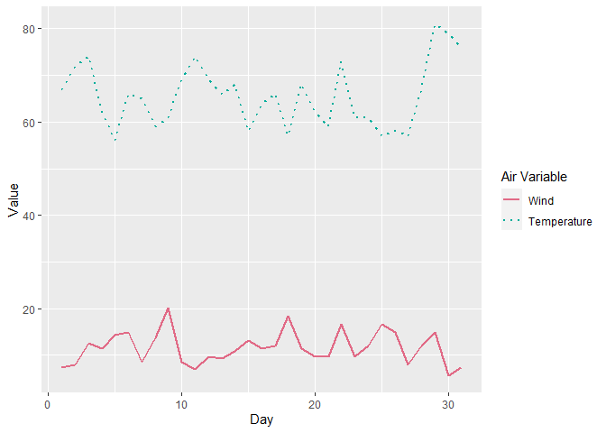

Custom Scales
================

Typically ggplot likes “tall” data. That is, if you want to plot 2 time
series on the same plot, you’re supposed to have a column that denotes
what time series is being plotted, and one that denotes the value to
plot, like this:

    ##   Day Variable Value
    ## 1   1    Ozone    41
    ## 2   1     Temp    67
    ## 3   2    Ozone    36
    ## 4   2     Temp    72
    ## 5   3    Ozone    12
    ## 6   3     Temp    74

Then when plotting a time series you can do something simple like
`ggplot(data) + geom_line(aes(x = Day, y = Value, colour = Variable))`

but this is not always the format your data will come in, or practical.
Often you’ll have “wide” data, where each value has it’s own column

    ##   Ozone Solar.R Wind Temp Month Day
    ## 1    41     190  7.4   67     5   1
    ## 2    36     118  8.0   72     5   2
    ## 3    12     149 12.6   74     5   3
    ## 4    18     313 11.5   62     5   4
    ## 5    NA      NA 14.3   56     5   5
    ## 6    28      NA 14.9   66     5   6

You can plot multiple lines on top of each other, by simply adding more
`geom_line()`s but this will not automatically make a legend for your
graph. To do that you should set up a manual scale, like this.

``` r
ggplot(airquality %>% filter(Month == 5)) +
  geom_line(mapping = aes(x = Day, y = Wind, colour = "1"), linewidth = 1) +
  geom_line(mapping = aes(x = Day, y = Temp, colour = "2"), linewidth = 1) +
  labs(x = "Day", y = "Value") +
  scale_colour_manual(name = "Air Variable", values = c("#E16A86", "#00AD9A"), labels = c("Wind", "Temperature"))
```

<!-- -->

Don’t forget to set the labels too, otherwise the y axis will probably
have the wrong name. This also applies to any other type of graph where
you might want to layer geoms on top of each other.

## A second scale

If you want to add a second scale, for example if you want to also have
a different line type, then you can simple add a new `scale_x_manual`
geom. If the new scale has the same name and the same labels, it will
overlay into a single legend.

``` r
ggplot(airquality %>% filter(Month == 5)) +
  geom_line(mapping = aes(x = Day, y = Wind, colour = "1", linetype = "1"), linewidth = 1) +
  geom_line(mapping = aes(x = Day, y = Temp, colour = "2", linetype = "2"), linewidth = 1) +
  labs(x = "Day", y = "Value") +
  scale_colour_manual(name = "Air Variable", values = c("#E16A86", "#00AD9A"), labels = c("Wind", "Temperature")) +
  scale_linetype_manual(name = "Air Variable", values = c("solid", "dotted"), labels = c("Wind", "Temperature"))
```

<!-- -->
