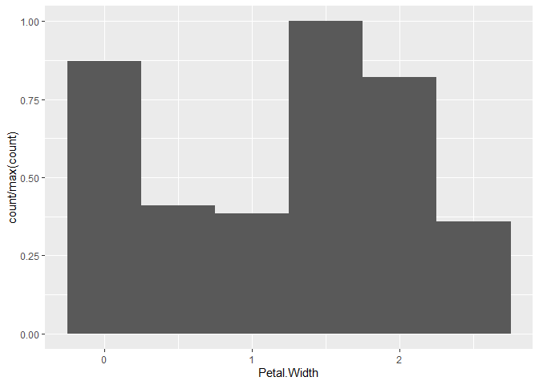
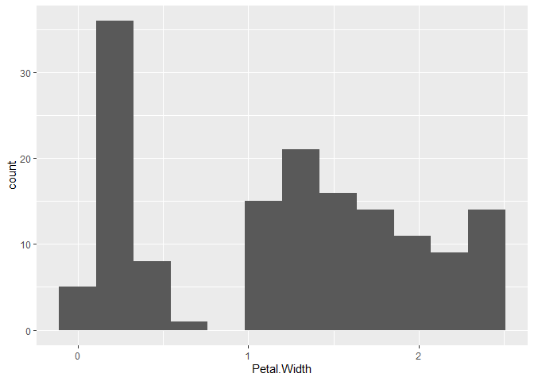

Histograms
================

## Rescaling the y axis

When you want to rescale the y axis (i.e for a density type plot) you
use after_stat in the mapping for y.

``` r
ggplot(iris) + geom_histogram(mapping = aes(x = Petal.Width, y = after_stat(density * width)), binwidth = 0.5)
```

<!-- -->

Plots a histogram scaled so the y axis is proportion of total amount

``` r
ggplot(iris) + geom_histogram(mapping = aes(x = Petal.Width, y = after_stat(count / max(count))), binwidth = 0.5)
```

<!-- -->

Scales the bins so that the tallest bin is 1.

## Automated bin width selection

``` r
riceRule = function(x) {
    width = max(x) - min(x)
    # Rice rule says the optimal number of bins is 2 times the cubed root of the number of samples rounded up
    n_bins = ceiling(2 * (length(x))^(1 / 3))
    bin_width = width / n_bins
    return(bin_width)
}
ggplot(iris) + geom_histogram(mapping = aes(x = Petal.Width), binwidth = riceRule)
```

<!-- -->

A less known fact is that you can pass a function to binwidth that takes
in the (unscaled) values as a vector and returns a single value for the
bin width.

## Adjusting the center of the bins

``` r
ggplot(iris) + geom_histogram(mapping = aes(x = Petal.Width), binwidth = 0.5, boundary = 0)
```

<!-- -->

You can use either boundary or center to define a single boundary or
center of bins to shuffle everything along. Useful for forcing bins to
cut on integer values.
